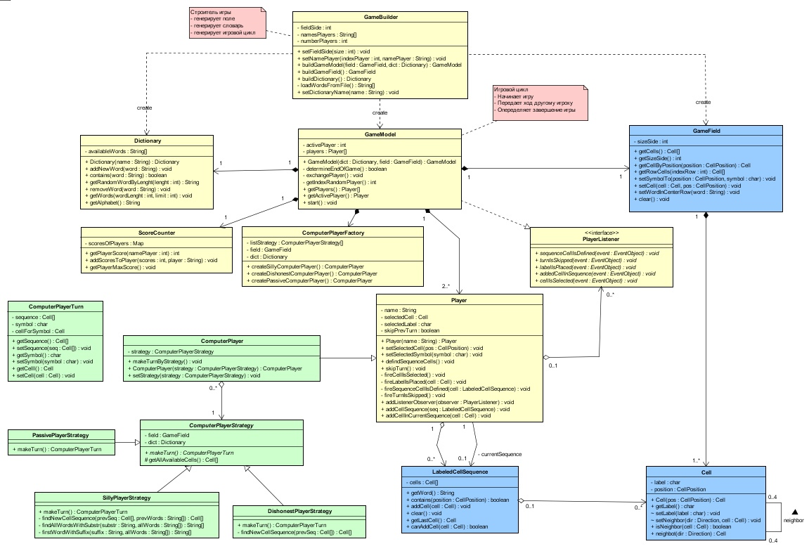
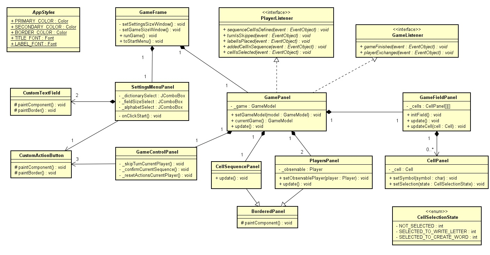
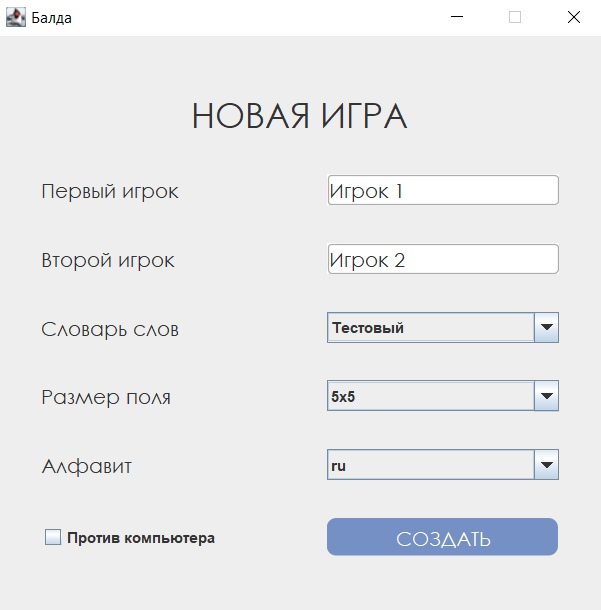
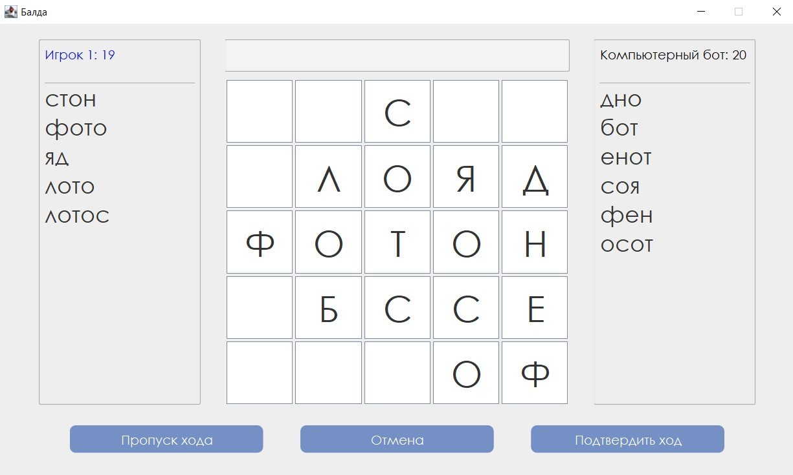

# Балда

Лингвистическая настольная игра для 2 игроков, в которой необходимо составлять слова с помощью букв, добавляемых определённым образом на квадратное игровое поле.
Реализована в наиболее популярном варианте игры, который имеет множество компьютерных реализаций, слова составляются посредством переходов от буквы к букве под прямым углом.

## Правила игры
- В начале игры есть поле из клеток, посреди которого написано слово.
- Игроки по очереди выбирают одну букву из алфавита и располагают ее на поле таким образом, чтобы получилось новое слово (игрок должен самостоятельно задать слово).
- Добавленная буква обязательно должна входить в новое слово.
- Игрок может пропустить ход.
- За каждое слово игрок получает некоторое количество очков, равное числу букв в слове.
- Побеждает игрок, набравший наибольшее количество очков.
- Правильность слов оценивается согласно словарю.

## Стек технологий

- Язык программирования __Java__
- Библиотека для создания графических интерфейсов __Swing__

## Диаграмма классов основной логики

Пакетный уровень доступа показан при помощи цвета класса

## Диаграмма классов представления

## Человеко-машинное взаимодействие

При запуске приложения открывается страница с настройками будущей игры.
На этой странице пользователь может указать имена игроков, размер поля, алфавит и словарь допустимых слов.

После запуска игры открывается отображается страница процесса текущей игры. На ней посередине отображается поле игры, на средней строке которого первое слово. Каждая ячейка поля является кнопкой, игрок кликает на нее ПКМ, когда выбирает ячейку для установки символа и когда указывает ячейки для составления слова.
По бокам от поля находятся панели для отображения информации о игроках, в них указывается количество баллов и составленные игроком слова. Имя активного игрока подсвечивается синим цветом (на рисунке выше, Игрок 1 - активный).
Ниже расположена панель для управления, на ней отображены кнопки: “Пропуск хода”, “Отменить”, “Подтвердить ход”.  
При нажатии на кнопку “Пропуск хода” активный игрок пропускает свой ход, не добавляя слово.  
При нажатии на кнопку “Отменить” сбрасывается выбранная активным игроком ячейка, символ и слово составленное из ячеек.
Ход остается у активного игрока.  
При нажатии на кнопку “Подтвердить ход” проверяется указанное игроком слово, и если оно является допустимым, ход переходит другому игроку.
Составленное слово попадает в список составленных игроком слов, а также за него начисляются баллы.
Если слово не является допустимым - должно открыться модальное окно, уведомляющее об этом. 

